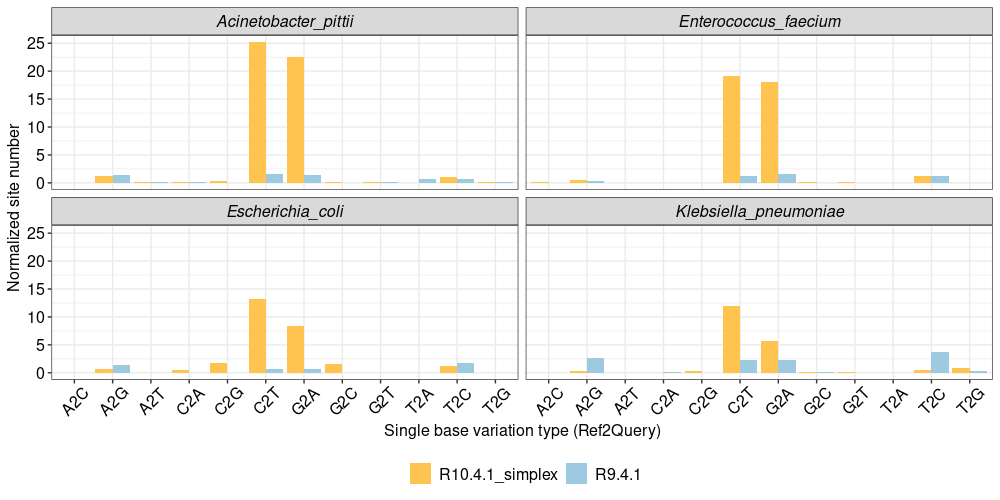

The cammands for how to count the substitution site number among the 35 genome drafts.

Here we used the results of Quast for **AB1 R941 data** as a example.

Demo for data formot

```shell
#ref	drafts	position_in_ref	base_in_ref	base_in_drafts	position_in_drafts
kp1_genome_pilon_pilon_pilon	contig_3	621640	A	T	61008
kp1_genome_pilon_pilon_pilon	contig_2	35312	T	G	3989182
kp1_genome_pilon_pilon_pilon	contig_2	40312	.	A	3984182
kp1_genome_pilon_pilon_pilon	contig_2	47812	.	G	3976681
kp1_genome_pilon_pilon_pilon	contig_2	53777	A	.	3970715
kp1_genome_pilon_pilon_pilon	contig_2	108652	T	.	3915841
kp1_genome_pilon_pilon_pilon	contig_2	114621	C	.	3909873
kp1_genome_pilon_pilon_pilon	contig_2	151480	C	.	3873136
kp1_genome_pilon_pilon_pilon	contig_2	238100	G	.	3786517
```

Cammands for normalizing the substitution base number for different 12 types.

```shell
# A base
cat *snps | awk '{print $1 "\t" $3 "\t" $4 "2" $5 }' | grep "A2C" | wc -l | awk '{print "R941\tab1\tA2C\t" $1/35}' >> out.txt
cat *snps | awk '{print $1 "\t" $3 "\t" $4 "2" $5 }' | grep "A2G" | wc -l | awk '{print "R941\tab1\tA2G\t" $1/35}' >> out.txt
cat *snps | awk '{print $1 "\t" $3 "\t" $4 "2" $5 }' | grep "A2T" | wc -l | awk '{print "R941\tab1\tA2T\t" $1/35}' >> out.txt
# C base
cat *snps | awk '{print $1 "\t" $3 "\t" $4 "2" $5 }' | grep "C2A" | wc -l | awk '{print "R941\tab1\tC2A\t" $1/35}' >> out.txt
cat *snps | awk '{print $1 "\t" $3 "\t" $4 "2" $5 }' | grep "C2G" | wc -l | awk '{print "R941\tab1\tC2G\t" $1/35}' >> out.txt
cat *snps | awk '{print $1 "\t" $3 "\t" $4 "2" $5 }' | grep "C2T" | wc -l | awk '{print "R941\tab1\tC2T\t" $1/35}' >> out.txt
# G base
cat *snps | awk '{print $1 "\t" $3 "\t" $4 "2" $5 }' | grep "G2A" | wc -l | awk '{print "R941\tab1\tG2A\t" $1/35}' >> out.txt
cat *snps | awk '{print $1 "\t" $3 "\t" $4 "2" $5 }' | grep "G2C" | wc -l | awk '{print "R941\tab1\tG2C\t" $1/35}' >> out.txt
cat *snps | awk '{print $1 "\t" $3 "\t" $4 "2" $5 }' | grep "G2T" | wc -l | awk '{print "R941\tab1\tG2T\t" $1/35}' >> out.txt
# T base
cat *snps | awk '{print $1 "\t" $3 "\t" $4 "2" $5 }' | grep "T2A" | wc -l | awk '{print "R941\tab1\tT2A\t" $1/35}' >> out.txt
cat *snps | awk '{print $1 "\t" $3 "\t" $4 "2" $5 }' | grep "T2C" | wc -l | awk '{print "R941\tab1\tT2C\t" $1/35}' >> out.txt
cat *snps | awk '{print $1 "\t" $3 "\t" $4 "2" $5 }' | grep "T2G" | wc -l | awk '{print "R941\tab1\tT2G\t" $1/35}' >> out.txt
```

Demo for output file

```shell
#group	bac	type	normalized_num
R941	ab1	A2C	0.0285714
R941	ab1	A2G	0.171429
R941	ab1	A2T	0.0285714
R941	ab1	C2A	0
R941	ab1	C2G	0.0285714
R941	ab1	C2T	2.05714
R941	ab1	G2A	1.54286
R941	ab1	G2C	0.0571429
R941	ab1	G2T	0.0571429
R941	ab1	T2A	0
```

Demo for plotting

```R
ggplot(df_2, aes(x=type, fill=group, y=value, group=group)) + 
  geom_bar(stat="identity", position='dodge') + facet_wrap("~bac") + theme_bw() +
  scale_x_discrete(name="Single base variation type (Ref2Query)") +
  scale_y_continuous(name="Normalized site number") +
  scale_fill_manual(values=c("R9.4.1"= "#9ecae1","R10.4.1_simplex" = "#fec44f")) + 
  theme(axis.text.y=element_text(size=12, color="black"),
        axis.text.x=element_text(size=12, color="black", angle=45, vjust = 0.6),
        axis.title=element_text(size=12, color="black"),
        legend.text = element_text(size=12, color="black"),
        strip.text = element_text(size=12, color="black",face="italic"),
        legend.title = element_blank(), legend.position = "bottom")
```

Demo for figure


